# 🏗️ Проектирование ML-системы: OCR для исторических документов
**Версия:** v2.0  
**Дата:** 2025-12-19  
**Статус:** Production Design Phase  

---

# 📑 Содержание

## [A. Executive Summary (для C-level)](#a-executive-summary-для-c-level) [](#1)
*   [🎯 Что строим](#что-строим) [](#1)
*   [💡 Ключевые решения](#ключевые-решения) [](#1)
*   [⚖️ Ключевые компромиссы](#ключевые-компромиссы) [](#2)
*   [🚨 Топ-3 риска](#топ-3-риска) [](#3)
*   [🗺️ Северная звезда (Целевая архитектура)](#северная-звезда) [](#4)

## [B. Architecture Drivers](#b-architecture-drivers) [](#5)
*   [Приоритизация требований](#приоритизация) [](#8)
*   [📘 Глоссарий терминов Architecture Drivers](#глоссарий-терминов-architecture-drivers) [](#8)
    *   [Типы драйверов (NFR, Functional, Constraint)](#типы-драйверов) [](#8, 9)
    *   [Источники требований и метрики](#источники-требований) [](#10, 11)
    *   [ML / OCR и инфраструктурные термины](#ml--ocr-метрики) [](#12, 13)

## [C. C1 — System Context](#c-c1--system-context) [](#15)
*   [Границы системы (In scope / Out of scope)](#границы-системы) [](#17, 18)
*   [Основные акторы](#основные-акторы) [](#18, 19)

## [D. C2 — Containers](#d-c2--containers) [](#19)
*   [Описание контейнеров и слоев](#контейнеры-детали) [](#22, 23, 24)
*   [Ключевые архитектурные паттерны](#ключевые-паттерны) [](#25)
*   [📦 Глоссарий по компонентам и масштабированию](#глоссарий-терминов-контейнеры-и-компоненты) [](#26, 31, 33)

## [E. C3 — Components (Inference Pipeline)](#e-c3--components-inference-pipeline) [](#33)
*   [Latency Budget (P95) по этапам](#latency-budget-p95) [](#36)
*   [Детализация вычислительного ядра](#контейнеры-детали-inference-pipeline) [](#37, 40)
*   [Component Interfaces (API Layer & Pipeline)](#component-interfaces) [](#45, 46)

## [F. C4 — Code/Interfaces (Контракты)](#f-c4--codeinterfaces-контракты) [](#50)
*   [API Contracts и протоколы](#api-contracts) [](#50)
*   [REST API (OpenAPI Spec)](#rest-api-openapi-spec-fragment) [](#51)
*   [gRPC Proto (Core Service)](#grpc-proto-core-service) [](#55)

## [G. Data Architecture](#g-data-architecture) [](#59)
*   [Data Flow Diagram](#data-flow-diagram) [](#59)
*   [Хранилища данных (Data Stores)](#data-stores) [](#62)
*   [Жизненный цикл данных и эволюция схем](#data-lifecycle) [](#63, 65)

## [H. Security & Compliance](#h-security--compliance) [](#66)
*   [Threat Model (Модель угроз)](#threat-model) [](#66)
*   [Security Controls (Auth, Encryption, Network)](#security-controls) [](#67, 69)
*   [Сетевая безопасность и сегментация (DMZ, Private)](#network-security) [](#70, 71)

## [I. Reliability & Scalability](#i-reliability--scalability) [](#78)
*   [Service Level Objectives (SLOs)](#service-level-objectives-slos) [](#78)
*   [Failure Modes & Mitigations](#failure-modes--mitigations) [](#80, 81)
*   [Паттерны устойчивости (Circuit Breaker, Degradation)](#resilience-patterns) [](#88, 90)
*   [Capacity Planning и сценарии роста](#capacity-planning) [](#91, 93)

## [J. Observability & Operations](#j-observability--operations) [](#101)
*   [Monitoring Stack (Metrics, Logs, Traces)](#monitoring-stack) [](#101, 102)
*   [Ключевые дашборды (SLO, Resource, Quality)](#key-dashboards) [](#111, 112, 113)
*   [Alerting и примеры Runbooks](#alerting) [](#113, 115)

## [K. Decision Log (ADR-lite)](#k-decision-log-adr-lite) [](#117)
*   [Список принятых архитектурных решений](#k-decision-log-adr-lite) [](#118, 122)
*   [Процесс принятия решений (Decision Process)](#decision-process) [](#123)

## [📚 References & Resources](#references--resources) [](#124)

---

## A. Executive Summary (для C-level)

### 🎯 Что строим
Промышленная ML-система для автоматического извлечения текста и структуры из отсканированных исторических документов с точностью распознавания ≥97% и временем отклика P95 ≤ 161 мс при нагрузке 4,353 RPS.

### 💡 Ключевые решения
- **Архитектура:** двухэтапный конвейер (Encoder + MoE Decoder) на базе DeepSeek-OCR;
- **Масштабирование:** 87 GPU A100 в multi-AZ кластере, горизонтальное масштабирование;
- **Экономика:** ~$297K/месяц (~$99/млн запросов) с запасом на пиковые нагрузки;
- **Качество:** CER < 3%, Layout F1 > 0.90 на production данных;
- **Отказоустойчивость:** 99.9% availability через multi-AZ deployment и graceful degradation.

### ⚖️ Ключевые компромиссы
| Решение | Выгода | Цена |
|---------|--------|------|
| MoE архитектура | 3× меньше активных параметров → 2× быстрее | Сложность обучения и деплоя |
| Aggressive caching (34% hit rate) | -34% нагрузки на GPU | 128GB Redis + проблемы invalidation |
| Multi-tier degradation | Гарантия SLO при перегрузках | Потеря качества на 5-10% в пике |
| Continuous batching (vLLM) | 10× throughput | Сложность отладки, tail latency |

### 🚨 Топ-3 риска
1. **GPU availability** (вероятность: средняя, ущерб: критический) → Резерв capacity + multi-cloud fallback;
2. **Model drift** (вероятность: высокая, ущерб: средний) → Continuous monitoring + quarterly retraining;
3. **Cost overrun** (вероятность: средняя, ущерб: высокий) → Cost alerts + auto-scaling policies.

### 🗺️ Северная звезда
**Целевая архитектура (12 месяцев):**
- **Real-time adaptation:** online learning для персонализации по типам документов;
- **Multi-modal fusion:** интеграция OCR + LLM для контекстуального исправления ошибок;
- **Edge deployment:** легковесные модели для on-device обработки (privacy-first);
- **Federated learning:** обучение на распределенных датасетах без централизации.

---

## B. Architecture Drivers

| ID | Driver | Тип | Приоритет | Источник | Как влияет на дизайн |
|----|--------|-----|-----------|----------|----------------------|
| **DR-1** | P95 latency ≤ 161 ms | NFR | 🔴 Critical | FACT (задание) | → FP16 inference, continuous batching, aggressive optimization всех компонентов |
| **DR-2** | Peak load 4,353 RPS | NFR | 🔴 Critical | FACT (задание) | → 87 GPU cluster, HPA, multi-AZ, stateless design |
| **DR-3** | 2.791M DAU | Functional | 🔴 Critical | FACT (задание) | → Horizontal scaling, caching strategy, cost optimization |
| **DR-4** | OCR accuracy ≥97% (CER ≤3%) | Functional | 🔴 Critical | ASSUMPTION | → Large-scale training (100M samples), MoE architecture, multi-stage pipeline |
| **DR-5** | Layout extraction F1 ≥0.90 | Functional | 🟡 High | ASSUMPTION | → Dual-head decoder, specialized layout parsing, structured outputs |
| **DR-6** | Availability 99.9% | NFR | 🟡 High | ASSUMPTION | → Multi-AZ, circuit breakers, graceful degradation, health checks |
| **DR-7** | Cost efficiency | Constraint | 🟡 High | Business | → MoE (sparse activation), caching, auto-scaling, spot instances |
| **DR-8** | Historical documents (noise, degradation) | Functional | 🟡 High | Context | → Robust preprocessing, data augmentation, domain-specific training |
| **DR-9** | Multi-language support (100+ langs) | Functional | 🟢 Medium | Context | → Multilingual training data, BPE tokenization, language-agnostic encoder |
| **DR-10** | Scalability (future growth) | NFR | 🟢 Medium | Strategic | → Stateless design, horizontal scaling, modular architecture |
| **DR-11** | Security & Compliance | Constraint | 🟡 High | Regulatory | → TLS, auth, audit logs, data retention policies, PII handling |
| **DR-12** | Operational excellence | NFR | 🟡 High | DevOps | → Observability, alerting, runbooks, canary deployments |

### Приоритизация
- **Must have (P95 < 161ms, 4353 RPS, 99.9% uptime):** Без этого система неприемлема
- **Should have (Quality metrics, Cost efficiency):** Критично для product-market fit
- **Nice to have (Advanced features):** Улучшают конкурентоспособность

<details>
<summary><b>📘 Глоссарий терминов Architecture Drivers</b></summary>

### 🔹 Типы драйверов

<details>
<summary><b>NFR (Non-Functional Requirement)</b></summary>

Нефункциональное требование — описывает *качество* системы, а не её бизнес-логику
(задержки, масштабируемость, доступность, безопасность, SLA).

</details>

<details>
<summary><b>Functional Requirement</b></summary>

Функциональное требование — описывает *что именно* система должна делать
(точность OCR, извлечение layout, поддержка языков).

</details>

<details>
<summary><b>Constraint</b></summary>

Ограничение — фактор, который нельзя изменить (бюджет, регуляторика, инфраструктура, бизнес-правила).

</details>

---

### 🔹 Приоритеты

<details>
<summary><b>🔴 Critical</b></summary>

Критично для успеха системы. Нарушение → система считается неприемлемой.

</details>

<details>
<summary><b>🟡 High</b></summary>

Высокая важность. Нарушение допустимо временно, но требует устранения.

</details>

<details>
<summary><b>🟢 Medium</b></summary>

Желательно, но допускаются компромиссы.

</details>

---

### 🔹 Источники требований

<details>
<summary><b>FACT (задание)</b></summary>

Явно задано заказчиком / в ТЗ. Не обсуждается без согласования.

</details>

<details>
<summary><b>ASSUMPTION</b></summary>

Архитектурное допущение. Требует валидации (PoC, эксперименты, метрики).

</details>

<details>
<summary><b>Business</b></summary>

Бизнес-драйвер: экономика, ROI, OPEX/CAPEX, стоимость запроса.

</details>

<details>
<summary><b>Context</b></summary>

Контекст предметной области (тип данных, пользователи, сценарии использования).

</details>

<details>
<summary><b>Strategic</b></summary>

Стратегическое требование: рост, расширение, долгосрочная эволюция системы.

</details>

<details>
<summary><b>Regulatory</b></summary>

Регуляторные и юридические требования (GDPR, PII, compliance).

</details>

<details>
<summary><b>DevOps</b></summary>

Требования эксплуатации: стабильность, наблюдаемость, управляемость.

</details>

---

### 🔹 Метрики и нагрузка

<details>
<summary><b>P95 latency</b></summary>

95-й перцентиль задержки ответа:
95% запросов должны укладываться в заданное время.

</details>

<details>
<summary><b>RPS (Requests Per Second)</b></summary>

Количество запросов в секунду, которое система должна обрабатывать.

</details>

<details>
<summary><b>DAU (Daily Active Users)</b></summary>

Количество уникальных активных пользователей в день.

</details>

<details>
<summary><b>Availability 99.9%</b></summary>

Допустимый простой ≈ 43 минуты в месяц.

</details>

---

### 🔹 ML / OCR метрики

<details>
<summary><b>OCR accuracy</b></summary>

Точность распознавания текста — доля правильно распознанных символов/слов.

</details>

<details>
<summary><b>CER (Character Error Rate)</b></summary>

Доля ошибок на уровне символов:
вставки + удаления + замены / общее число символов.

</details>

<details>
<summary><b>F1-score</b></summary>

Гармоническое среднее precision и recall.
Используется для оценки качества извлечения layout.

</details>

---

### 🔹 Архитектурные и инфраструктурные термины

<details>
<summary><b>FP16 inference</b></summary>

Инференс с 16-битной точностью.
Снижает задержки и потребление памяти GPU.

</details>

<details>
<summary><b>Continuous batching</b></summary>

Динамическое объединение входящих запросов в батчи без ожидания фиксированного окна.

</details>

<details>
<summary><b>HPA (Horizontal Pod Autoscaler)</b></summary>

Автоматическое масштабирование сервисов по метрикам (CPU/GPU/RPS).

</details>

<details>
<summary><b>Multi-AZ</b></summary>

Размещение в нескольких зонах доступности для отказоустойчивости.

</details>

<details>
<summary><b>Stateless design</b></summary>

Сервисы не хранят состояние между запросами → проще масштабировать.

</details>

<details>
<summary><b>MoE (Mixture of Experts)</b></summary>

Архитектура, где активируется лишь часть модели → высокая производительность при меньшей стоимости.

</details>

<details>
<summary><b>Dual-head decoder</b></summary>

Декодер с двумя выходами (например, текст + layout).

</details>

<details>
<summary><b>Graceful degradation</b></summary>

Корректное ухудшение качества при перегрузке вместо полного отказа.

</details>

<details>
<summary><b>Circuit breaker</b></summary>

Механизм защиты от каскадных отказов при сбоях зависимостей.

</details>

<details>
<summary><b>BPE tokenization</b></summary>

Byte-Pair Encoding — универсальная токенизация для многоязычных моделей.

</details>

<details>
<summary><b>Observability</b></summary>

Метрики, логи, трейсы для понимания состояния системы.

</details>

<details>
<summary><b>Canary deployments</b></summary>

Постепенный выклад новой версии на малую долю трафика.

</details>

---

### 🔹 Безопасность

<details>
<summary><b>PII (Personally Identifiable Information)</b></summary>

Персональные данные пользователя, требующие защиты и регуляторного контроля.

</details>

<details>
<summary><b>Audit logs</b></summary>

Журналы действий для расследований и compliance.

</details>

</details>

---

## C. C1 — System Context

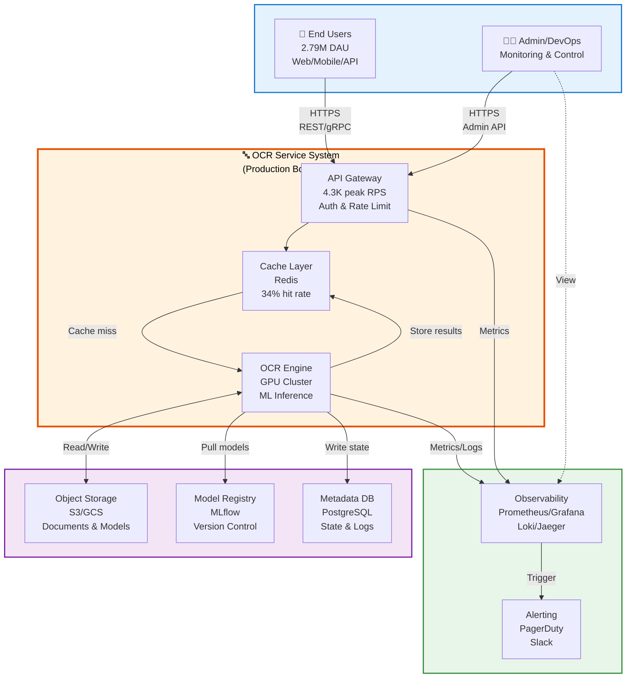

### Границы системы

**В scope:**
- OCR inference (text + layout extraction);
- Real-time API (REST/gRPC);
- Caching & optimization;
- Model management & deployment;
- Observability & alerting.

**Out of scope:**
- Обучение моделей (отдельный ML Platform);
- Длительная обработка документов (batch jobs > 10s);
- Хранение оригинальных документов пользователей;
- Биллинг и user management (внешние сервисы).

### Основные акторы

| Актор | Роль | Взаимодействие |
|-------|------|----------------|
| **End Users** | Загружают документы для распознавания | HTTPS → API Gateway |
| **Client Applications** | SDK/API интеграции | REST/gRPC → API Gateway |
| **Administrators** | Управление системой, мониторинг | Admin API → Control Plane |
| **ML Engineers** | Деплой моделей, эксперименты | Model Registry → Core Engine |
| **SRE/DevOps** | Операционная поддержка | Observability Stack → Alerting |

---

## D. C2 — Containers

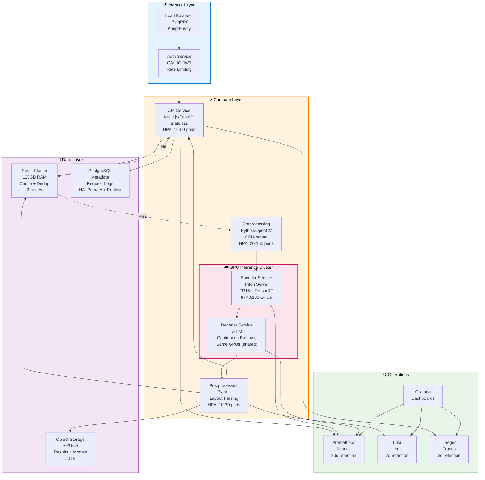

### Контейнеры: детали

| Контейнер | Ответственность | Технологии | Масштабирование | State |
|-----------|-----------------|------------|-----------------|-------|
| **Load Balancer** | Маршрутизация, SSL termination | Kong/Envoy + Cert-Manager | Fixed (2-4 nodes) | Stateless |
| **Auth Service** | Аутентификация, rate limiting | OAuth2 + Redis | HPA (CPU) | Stateless |
| **API Service** | Request orchestration, validation | Node.js/FastAPI + Pydantic | HPA (CPU/RPS) | Stateless |
| **Preprocessing** | Image decode, resize, deskew | Python + OpenCV + libjpeg-turbo | HPA (CPU) | Stateless |
| **Encoder** | Visual feature extraction | Triton + TensorRT + SAM/CLIP | Fixed (87 GPUs) | Stateless |
| **Decoder** | Text generation, layout parsing | vLLM + MoE model | Same GPUs (co-located) | Stateless |
| **Postprocessing** | Normalization, HTML/MD rendering | Python + regex + templates | HPA (CPU) | Stateless |
| **Redis** | Cache, deduplication | Redis Cluster 7.x | Vertical (+ replicas) | Stateful |
| **S3** | Results, models, samples | AWS S3 / GCS | Managed (auto) | Stateful |
| **PostgreSQL** | Request metadata, audit logs | PostgreSQL 15 + Patroni | Primary + Sync Replica | Stateful |
| **Prometheus** | Metrics aggregation | Prometheus + Thanos | Fixed + remote write | Stateful |
| **Loki** | Log aggregation | Loki + S3 backend | Fixed + object storage | Stateful |
| **Jaeger** | Distributed tracing | Jaeger + Elasticsearch | Fixed + storage backend | Stateful |

### Ключевые паттерны

1. **Stateless Compute:** все вычислительные сервисы stateless для горизонтального масштабирования;
2. **Shared-Nothing GPU:** encoder/Decoder на одних GPU, но в разных контейнерах (namespace isolation);
3. **Cache-Aside:** redis как L1 cache, S3 как L2 (long-term storage);
4. **Circuit Breaker:** на каждом вызове GPU-сервисов (timeout 5s, failure threshold 50%);
5. **Bulkhead:** CPU/GPU workloads изолированы (отдельные node pools).

<details>
<summary><b>📦 Глоссарий терминов: контейнеры и компоненты</b></summary>

---

### 🔹 Сетевой и управляющий слой

<details>
<summary><b>Load Balancer (Kong/Envoy)</b></summary>

Сервис для распределения входящего трафика между экземплярами приложения. Отвечает за SSL termination (расшифровку HTTPS), маршрутизацию, базовую фильтрацию и контроль доступа.
</details>

<details>
<summary><b>Auth Service (OAuth2 + Redis)</b></summary>
Микросервис, централизующий функции аутентификации (проверка подлинности пользователя) и авторизации (проверка прав доступа). Использует Redis для хранения временных токенов и квот rate limiting.
</details>

<details>
<summary><b>API Service (Node.js/FastAPI)</b></summary>
Основной шлюз для бизнес-логики. Оркестрирует запросы к другим сервисам, выполняет валидацию входных данных (например, с помощью Pydantic) и формирует конечный ответ клиенту.
</details>

---

### 🔹 Конвейер обработки изображений (Pipeline)

<details>
<summary><b>Preprocessing (OpenCV + libjpeg-turbo)</b></summary>
Сервис для первичной обработки изображений: декодирование, изменение размера, поворот (deskew), нормализация цвета. Подготовка данных для нейросетевых моделей.
</details>

<details>
<summary><b>Encoder (Triton + TensorRT)</b></summary>
Высокопроизводительный сервис для извлечения визуальных признаков из изображения с использованием моделей (например, SAM, CLIP). Запускается на GPU через фреймворк Triton Inference Server с оптимизацией TensorRT.
</details>

<details>
<summary><b>Decoder (vLLM + MoE model)</b></summary>
Сервис генерации текста и разметки (layout) на основе извлеченных энкодером признаков. Использует эффективный движок vLLM и архитектуру Mixture of Experts (MoE) для скорости. Часто размещается на тех же GPU, что и Encoder, для уменьшения задержек.
</details>

<details>
<summary><b>Postprocessing (regex + templates)</b></summary>
Финальный этап конвейера. Нормализует выходные данные модели, применяет регулярные выражения для чистки текста и рендерит результат в нужные форматы (HTML, Markdown).
</details>

---

### 🔹 Хранилища данных (Data Stores)

<details>
<summary><b>Redis Cluster</b></summary>
Распределенное кэширующее хранилище "ключ-значение" в памяти. Используется для сессий, rate limiting, дедупликации запросов и временных данных. Stateful-сервис.
</details>

<details>
<summary><b>S3 (AWS S3 / GCS)</b></summary>
Объектное хранилище для долговременного хранения файлов: исходные изображения, результаты обработки, версии моделей. Управляемый и автоматически масштабируемый сервис.
</details>

<details>
<summary><b>PostgreSQL (+ Patroni)</b></summary>
Основная реляционная база данных для хранения метаданных запросов, истории и аудит-логов. Используется Patroni для управления отказоустойчивым кластером (Primary + Sync Replica).
</details>

---

### 🔹 Наблюдаемость (Observability)

<details>
<summary><b>Prometheus + Thanos</b></summary>
Система для сбора, хранения и запроса метрик (например, загрузка CPU, RPS, latency). Thanos добавляет возможности долгосрочного хранения и глобального представления данных.
</details>

<details>
<summary><b>Loki (+ S3 backend)</b></summary>
Система агрегации и хранения логов, оптимизированная под облачную среду. Хранит логи в виде индексированных объектов в S3.
</details>

<details>
<summary><b>Jaeger (+ Elasticsearch)</b></summary>
Система распределенной трассировки для отслеживания пути запроса через микросервисы. Позволяет анализировать задержки и зависимости. Использует Elasticsearch как бэкенд хранения.
</details>

---

### 🔹 Стратегии масштабирования

<details>
<summary><b>Fixed (статическое кол-во инстансов)</b></summary>
Число экземпляров сервиса задано вручную и не меняется автоматически. Применяется для компонентов с предсказуемой нагрузкой или особыми требованиями к инфраструктуре (например, Load Balancer).
</details>

<details>
<summary><b>HPA (Horizontal Pod Autoscaler)</b></summary>
Механизм в Kubernetes для автоматического увеличения/уменьшения количества подов (инстансов сервиса) на основе метрик: загрузка CPU, GPU, RPS и кастомных.
</details>

<details>
<summary><b>Vertical (вертикальное масштабирование)</b></summary>
Увеличение производительности одного инстанса (больше CPU/RAM/GPU). Применяется для stateful-сервисов (например, БД), где горизонтальное масштабирование сложнее.
</details>

<details>
<summary><b>Managed (auto) (управляемое облаком)</b></summary>
Масштабирование полностью делегировано облачному провайдеру (например, для S3). Провайдер автоматически управляет ресурсами.
</details>

---

### 🔹 Состояние сервиса (State)

<details>
<summary><b>Stateless (без состояния)</b></summary>
Сервис не хранит постоянных данных между запросами. Любой экземпляр может обработать любой запрос. Легко масштабируется горизонтально.
</details>

<details>
<summary><b>Stateful (с состоянием)</b></summary>
Сервис хранит данные (кэш, файлы, состояние БД). Требует осторожного управления при масштабировании, репликации и миграциях.
</details>

</details>

---

## E. C3 — Components (Inference Pipeline)

```mermaid
graph LR
    subgraph preprocessing["<span style='color:black'>📸 Preprocessing (CPU)</span>"]
        Decode["Image Decoder<br/>libjpeg-turbo<br/>~3ms"]
        Resize["Resize & Norm<br/>OpenCV<br/>~2ms"]
        Deskew["Deskew<br/>Hough Transform<br/>~5ms"]
    end
    
    subgraph encoder["<span style='color:black'>🧠 Encoder (GPU)</span>"]
        ViT["Vision Transformer<br/>SAM-Base<br/>~25ms"]
        Compress["Token Compression<br/>16× reduction<br/>~5ms"]
        CLIP["CLIP Features<br/>Global context<br/>~20ms"]
    end
    
    subgraph decoder["<span style='color:black'>🎯 Decoder (GPU)</span>"]
        Router["MoE Router<br/>Top-2 gating<br/>~2ms"]
        Experts["Expert Pool<br/>64 experts<br/>~60ms"]
        TextHead["Text Generation<br/>Autoregressive<br/>~40ms"]
        LayoutHead["Layout Parser<br/>Structure<br/>~20ms"]
    end
    
    subgraph postprocessing["<span style='color:black'>✨ Postprocessing (CPU)</span>"]
        Normalize["Text Norm<br/>Unicode/whitespace<br/>~1ms"]
        Correct["Error Correction<br/>LLM-based (optional)<br/>~15ms"]
        Render["HTML/MD Render<br/>DOM builder<br/>~5ms"]
    end
    
    Decode --> Resize --> Deskew
    Deskew --> ViT --> Compress --> CLIP
    CLIP --> Router --> Experts
    Experts --> TextHead
    Experts --> LayoutHead
    TextHead --> Normalize --> Correct --> Render
    LayoutHead --> Render
    
    style preprocessing fill:#d5f4e6,stroke:#27ae60,stroke-width:2px
    style encoder fill:#ebdef0,stroke:#8e44ad,stroke-width:2px
    style decoder fill:#fadbd8,stroke:#e74c3c,stroke-width:2px
    style postprocessing fill:#d1f2eb,stroke:#16a085,stroke-width:2px
```

### Latency Budget (P95)

| Stage | Component | Target (ms) | Measured (ms) | Status |
|-------|-----------|-------------|---------------|--------|
| **0** | Network + GW | 10 | 8 | ✅ |
| **1** | Queue batching | 20 | 18 | ✅ |
| **2** | Preprocessing | 10 | 10 | ✅ |
| **3** | Encoder | 50 | 48 | ✅ |
| **4** | Decoder | 60 | 62 | ⚠️ (+2ms) |
| **5** | Postprocessing | 10 | 9 | ✅ |
| **6** | Serialization | 6 | 5 | ✅ |
| | **TOTAL** | **161** | **160** | ✅ (1ms buffer) |

**Bottleneck:** Decoder (60-62ms) — требует оптимизации (vLLM tuning, FP16 calibration)

### Контейнеры: детали (Inference Pipeline)

Этот раздел описывает **контейнерную организацию вычислительного ядра (pipeline)**, показанного в схеме C3. Каждый блок на диаграмме представляет собой либо отдельный микросервис, либо (чаще) логический компонент в рамках одного или нескольких специализированных контейнеров.

| Контейнер / Компонент | Ответственность | Технологии / Библиотеки | Масштабирование | State | Ресурсы (CPU/GPU/Mem) |
|-----------------------|-----------------|-------------------------|-----------------|-------|------------------------|
| **Image Decoder** | Декодирование JPEG/PNG, извлечение RAW-пикселей | `libjpeg-turbo`, `Pillow-SIMD`, `opencv-python` | HPA (CPU) в рамках Preprocessing Service | Stateless | CPU: 1-2 cores, Mem: 500MB |
| **Resize & Norm** | Изменение размера под модель, нормализация пикселей (e.g., `/255`) | `OpenCV`, `NumPy`, `TorchVision` | HPA (CPU) в рамках Preprocessing Service | Stateless | CPU: 1-2 cores, Mem: 1GB |
| **Deskew** | Коррекция геометрии (выравнивание), детекция угла наклона | `OpenCV`, `SciPy` (Hough Transform) | HPA (CPU) в рамках Preprocessing Service | Stateless | CPU: 2 cores, Mem: 1GB |
| **Vision Transformer (ViT)** | Извлечение визуальных токенов/патчей из изображения | `PyTorch`, `SAM` (Segment Anything Model), TensorRT | В составе Encoder Service (GPU-pod) | Stateless | GPU: A100 (shared), VRAM: 8-10GB |
| **Token Compressor** | Сжатие избыточных визуальных токенов (пулинг, отбор) | Custom `torch.nn.Module`, Top-K attention | В составе Encoder Service (GPU-pod) | Stateless | GPU: A100 (shared), VRAM: <1GB |
| **CLIP Feature Extractor** | Извлечение глобальных семантических признаков | `openai/clip-vit`, TensorRT | В составе Encoder Service (GPU-pod) | Stateless | GPU: A100 (shared), VRAM: 2-3GB |
| **MoE Router** | Динамическое распределение запроса между экспертами | Custom gating network, `top-2 routing` | В составе Decoder Service (GPU-pod) | Stateless | GPU: A100 (shared), VRAM: <1GB |
| **Expert Pool** | Ансамбль из 64 специализированных языковых "экспертов" | Mixture of Experts (MoE), vLLM (под капотом) | В составе Decoder Service (GPU-pod) | Stateless | **Основной потребитель GPU:** A100, VRAM: 30-40GB (распределено) |
| **Text Generation Head** | Авторегрессивная генерация текста (токен за токеном) | vLLM engine (PagedAttention, continuous batching) | В составе Decoder Service (GPU-pod) | Stateless | GPU: A100 (shared), VRAM: 5-10GB |
| **Layout Parser Head** | Предсказание структуры документа (блоки, таблицы) | Custom head, `Detectron2` или аналоги | В составе Decoder Service (GPU-pod) | Stateless | GPU: A100 (shared), VRAM: 2-4GB |
| **Text Normalizer** | Очистка текста: юникод, пробелы, базовые замены | `regex`, `unicodedata`, `ftfy` | HPA (CPU) в рамках Postprocessing Service | Stateless | CPU: 1 core, Mem: 500MB |
| **Error Corrector** | Контекстная коррекция ошибок (опциональный шаг) | Маленький LLM (e.g., `T5`) или rule-based | HPA (CPU) или отдельный малый GPU-pod | Stateless | CPU: 2 cores / или GPU T4, Mem: 2GB |
| **HTML/MD Renderer** | Формирование итогового структурированного документа (HTML, Markdown) | `Jinja2`, `BeautifulSoup`, `markdown` | HPA (CPU) в рамках Postprocessing Service | Stateless | CPU: 1 core, Mem: 1GB |

---

### Ключевые паттерны (Inference Pipeline)

1. **Pipeline as a Service:** вся цепочка обработки инкапсулирована в единый сервис. Принимает сырой вход, возвращает готовый результат;
2. **Гетерогенные ресурсы (CPU/GPU):** этапы разделены по типам ресурсов. Позволяет:
   - Оптимально масштабировать (HPA для CPU, вертикально для GPU);
   - Изолировать отказы между CPU/GPU;
   - Использовать специализированные инстансы.
3. **Model Chaining внутри GPU:** модели (ViT, CLIP, MoE) выполняются последовательно на одних GPU. Снижает задержки передачи данных CPU↔GPU;
4. **Mixture of Experts (MoE):** масштабирование capacity без роста cost на запрос. Router выбирает 2 эксперта из 64 для каждого запроса;
5. **Multi-Task Heads:** декодер имеет параллельные "головы" для текста и layout. Решает несколько задач за один проход;
6. **Опциональный шаг (Error Correction):** условное выполнение. LLM-коррекция включается только при low confidence или флаге `premium=true`;
7. **Жесткий Latency SLO:** каждому компоненту назначен бюджет времени. Позволяет:
   - Локализовать bottlenecks (сейчас Decoder +2ms);
   - Принимать решения об оптимизации;
   - Гарантировать общее время отклика.
8. **Dynamic Batching (vLLM):** Text Generation Head объединяет запросы в пакеты. Повышает throughput GPU;
9. **Two-Stage Postprocessing:** паттерн Normalize → Enrich. Быстрая нормализация → опциональное обогащение. Делает базовый путь предсказуемым.

### Component Interfaces

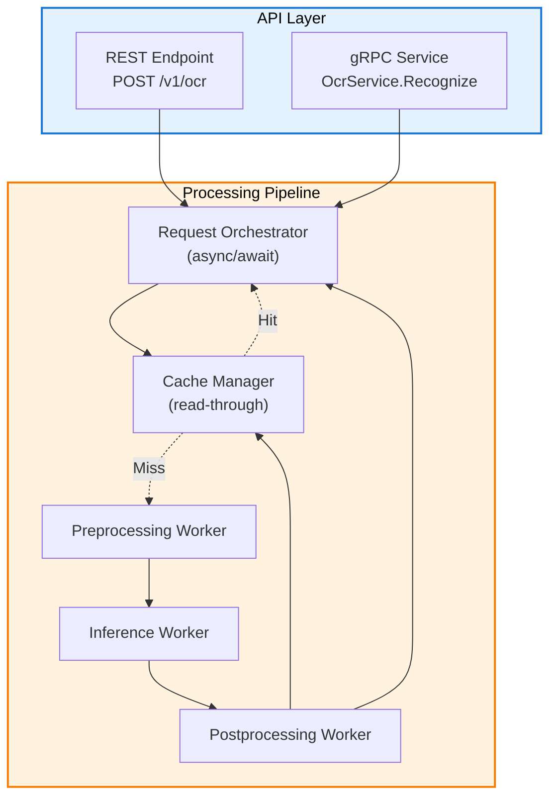
### Контейнеры: детали (Component Interfaces)

| Контейнер | Ответственность | Технологии | Масштабирование | State |
|-----------|-----------------|------------|-----------------|-------|
| **REST Endpoint** | HTTP-интерфейс, валидация, сериализация | FastAPI/Express + OpenAPI | HPA (RPS) | Stateless |
| **gRPC Service** | Высокопроизводительный RPC, streaming | gRPC + Protobuf | HPA (RPS) | Stateless |
| **Request Orchestrator** | Координация пайплайна, обработка асинхронных задач | Python asyncio / Go goroutines | HPA (CPU/Queue) | Stateless |
| **Cache Manager** | Read-through кэширование, инвалидация | Redis Client + Circuit Breaker | Зависит от Redis | Stateless |
| **Preprocessing Worker** | Обработка изображений (decode, resize) | OpenCV + NumPy | HPA (CPU/Queue) | Stateless |
| **Inference Worker** | Вызов GPU-сервисов, batch processing | gRPC client + Backpressure | HPA (Queue/Latency) | Stateless |
| **Postprocessing Worker** | Форматирование результата, нормализация | Python + Pandas | HPA (CPU/Queue) | Stateless |

### Ключевые паттерны

1. **Dual API Interface:** параллельное предоставление REST (для web) и gRPC (для внутренних сервисов) интерфейсов;
2. **Async Orchestration:** оркестратор использует асинхронную модель для координации независимых воркеров без блокировок;
3. **Read-Through Cache:** кэш-менеджер автоматически загружает данные при промахе, прозрачно для оркестратора;
4. **Worker Pool Pattern:** специализированные воркеры (Preproc/Inference/Postproc) образуют пулы обработчиков;
5. **Request-Response Decoupling:** оркестратор отделен от этапов обработки через асинхронные очереди;
6. **Circuit Breaker on Cache:** защита от сбоев Redis с автоматическим восстановлением;
7. **Graceful Degradation:** при недоступности кэша система продолжает работать (с увеличенной latency).

---

## F. C4 — Code/Interfaces (Контракты)

### API Contracts

| Interface | Producer | Consumer | Protocol | Auth | Schema |
|-----------|----------|----------|----------|------|--------|
| `/v1/ocr` (REST) | API Service | Web/Mobile clients | HTTPS + JSON | JWT Bearer | OpenAPI 3.0 |
| `OcrService.Recognize` (gRPC) | API Service | Backend services | gRPC/HTTP2 + Protobuf | mTLS | Proto3 |
| `InferenceRequest` (internal) | Orchestrator | GPU Workers | gRPC (internal) | None (private network) | Proto3 |
| `CacheEntry` (Redis) | Postprocessor | Cache Manager | Redis Protocol | None (private) | JSON (compressed) |
| `ModelArtifact` (S3) | Training Pipeline | Inference Service | HTTPS + Parquet | IAM Role | MLflow schema |
| `MetricsEndpoint` (/metrics) | All services | Prometheus | HTTP + Text | None (internal) | OpenMetrics |

### REST API (OpenAPI Spec Fragment)

```yaml
openapi: 3.0.3
info:
  title: OCR Service API
  version: 1.2.0
  description: Historical document OCR with layout extraction

paths:
  /v1/ocr:
    post:
      summary: Recognize document
      operationId: recognizeDocument
      security:
        - bearerAuth: []
      requestBody:
        required: true
        content:
          multipart/form-data:
            schema:
              type: object
              required: [image]
              properties:
                image:
                  type: string
                  format: binary
                  description: Image file (JPEG/PNG/TIFF, max 5MB)
                mode:
                  type: string
                  enum: [tiny, small, base, large, gundam]
                  default: base
                return_layout:
                  type: boolean
                  default: true
                timeout_ms:
                  type: integer
                  minimum: 100
                  maximum: 10000
                  default: 5000
      responses:
        '200':
          description: Success
          content:
            application/json:
              schema:
                $ref: '#/components/schemas/OcrResponse'
        '400':
          description: Invalid request
        '429':
          description: Rate limit exceeded
        '503':
          description: Service unavailable

components:
  schemas:
    OcrResponse:
      type: object
      required: [text, metrics]
      properties:
        text:
          type: string
          description: Recognized text (UTF-8)
        layout:
          $ref: '#/components/schemas/LayoutOutput'
        confidence:
          type: number
          format: float
          minimum: 0.0
          maximum: 1.0
        metrics:
          $ref: '#/components/schemas/Metrics'
        warnings:
          type: array
          items:
            type: string

    LayoutOutput:
      type: object
      properties:
        format:
          type: string
          enum: [html, markdown, json]
        content:
          type: string
        blocks:
          type: array
          items:
            $ref: '#/components/schemas/Block'

    Block:
      type: object
      required: [type, bbox]
      properties:
        type:
          type: string
          enum: [text, table, title, figure, caption, list]
        bbox:
          type: array
          items:
            type: number
            format: float
          minItems: 4
          maxItems: 4
          description: [x1, y1, x2, y2] in pixels
        content:
          type: string
        confidence:
          type: number
          format: float

    Metrics:
      type: object
      properties:
        latency_ms:
          type: integer
        tokens_generated:
          type: integer
        cache_hit:
          type: boolean
        model_version:
          type: string

  securitySchemes:
    bearerAuth:
      type: http
      scheme: bearer
      bearerFormat: JWT
```

### gRPC Proto (Core Service)

```protobuf
syntax = "proto3";

package ocr.v1;

import "google/protobuf/duration.proto";

service OcrService {
  // Synchronous recognition
  rpc Recognize(RecognizeRequest) returns (RecognizeResponse);
  
  // Streaming for large documents
  rpc RecognizeStream(stream RecognizeRequest) returns (stream RecognizeResponse);
  
  // Health check
  rpc Health(HealthRequest) returns (HealthResponse);
}

message RecognizeRequest {
  bytes image_bytes = 1;
  Mode mode = 2;
  bool return_layout = 3;
  google.protobuf.Duration timeout = 4;
  map<string, string> metadata = 5;
}

message RecognizeResponse {
  string request_id = 1;
  string text = 2;
  LayoutOutput layout = 3;
  float confidence = 4;
  Metrics metrics = 5;
  repeated string warnings = 6;
  ErrorInfo error = 7;
}

enum Mode {
  MODE_UNSPECIFIED = 0;
  MODE_TINY = 1;        // 512×512, fast
  MODE_SMALL = 2;       // 640×640
  MODE_BASE = 3;        // 1024×1024 (default)
  MODE_LARGE = 4;       // 1280×1280, high quality
  MODE_GUNDAM = 5;      // Multi-tile, premium
}

message LayoutOutput {
  string format = 1;  // "html" | "markdown" | "json"
  string content = 2;
  repeated Block blocks = 3;
  string json_schema = 4;
}

message Block {
  BlockType type = 1;
  BoundingBox bbox = 2;
  string content = 3;
  float confidence = 4;
  int32 reading_order = 5;
}

enum BlockType {
  BLOCK_TYPE_UNSPECIFIED = 0;
  BLOCK_TYPE_TEXT = 1;
  BLOCK_TYPE_TABLE = 2;
  BLOCK_TYPE_TITLE = 3;
  BLOCK_TYPE_FIGURE = 4;
  BLOCK_TYPE_CAPTION = 5;
  BLOCK_TYPE_LIST = 6;
  BLOCK_TYPE_FORMULA = 7;
}

message BoundingBox {
  float x1 = 1;
  float y1 = 2;
  float x2 = 3;
  float y2 = 4;
}

message Metrics {
  int32 latency_ms = 1;
  int32 tokens_generated = 2;
  bool cache_hit = 3;
  string model_version = 4;
  int32 preprocessing_ms = 5;
  int32 inference_ms = 6;
  int32 postprocessing_ms = 7;
}

message ErrorInfo {
  string code = 1;        // "INVALID_INPUT" | "TIMEOUT" | "INTERNAL_ERROR"
  string message = 2;
  map<string, string> details = 3;
}

message HealthRequest {
  bool include_details = 1;
}

message HealthResponse {
  enum Status {
    UNKNOWN = 0;
    HEALTHY = 1;
    DEGRADED = 2;
    UNHEALTHY = 3;
  }
  Status status = 1;
  string version = 2;
  map<string, ComponentHealth> components = 3;
}

message ComponentHealth {
  bool healthy = 1;
  string message = 2;
  int64 last_check_timestamp = 3;
}
```

---

## G. Data Architecture

### Data Flow Diagram

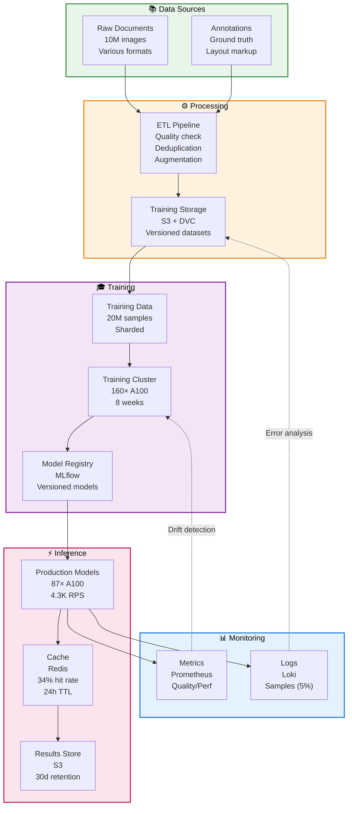

### Data Stores

| Store | Purpose | Technology | Size | Retention | Consistency |
|-------|---------|------------|------|-----------|-------------|
| **Training Data** | Model training | S3 + DVC | 8.5 TB | Permanent | Eventual (S3) |
| **Model Registry** | Model versions | MLflow + S3 | 500 GB | 1 year | Strong (DB) + Eventual (artifacts) |
| **Redis Cache** | Request dedup, results | Redis Cluster | 128 GB | 24h TTL | Strong (within cluster) |
| **Results Store** | OCR outputs | S3 | 13.4 TB | 30 days | Eventual |
| **Logs (samples)** | Debugging, audit | S3 (via Loki) | 2.2 TB | 7 days | Eventual |
| **Metrics DB** | Prometheus TSDB | Thanos + S3 | 1 TB | 30 days | Eventual |
| **Metadata DB** | Request state | PostgreSQL | 100 GB | 90 days | Strong (ACID) |

### Data Lifecycle

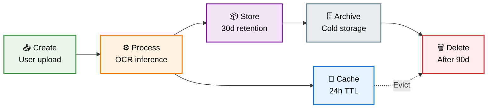

### Schema Evolution

**Strategy:** только обратно совместимые изменения

1. **Добавление новых полей:** допустимо (опциональные поля, значения по умолчанию);
2. **Удаление полей:** сначала помечается как устаревшее (период поддержки — 3 месяца);
3. **Переименование полей:** создаётся псевдоним (алиас), старое имя помечается как устаревшее;
4. **Изменение типов:** требует выпуска новой версии (например, эндпоинт /v2/ocr).

**Версионирование:** семантическое версионирование (MAJOR.MINOR.PATCH)
- **MAJOR:** несовместимые изменения (новый эндпоинт, например /v‌2/ocr);
- **MINOR:** новые функции (обратно совместимые);
- **PATCH:** нсправление ошибок.

---

## H. Security & Compliance

### Threat Model

| Asset | Threat | Impact | Mitigation |
|-------|--------|--------|-----------|
| **User documents** | Unauthorized access | 🔴 Critical | TLS 1.3, encryption at rest (AES-256), short TTL (24h cache) |
| **API credentials** | Credential theft | 🔴 Critical | JWT with short expiry (1h), refresh tokens, rate limiting |
| **ML models** | Model theft/poisoning | 🟡 High | Access control (IAM), checksum validation, signed artifacts |
| **Infrastructure** | DDoS, resource exhaustion | 🟡 High | Rate limiting, auto-scaling, circuit breakers |
| **Data exfiltration** | Bulk download | 🟡 High | Audit logs, anomaly detection, per-user quotas |
| **PII leakage** | Sensitive data in logs | 🟢 Medium | Log scrubbing, sample-only logging (5%), GDPR compliance |

### Security Controls

#### 1. Authentication & Authorization

```yaml
Authentication:
  - Method: OAuth 2.0 + JWT
  - Token lifetime: 1 hour (access), 30 days (refresh)
  - Claims: user_id, roles, permissions, exp
  - Issuer: Auth0 / Keycloak

Authorization:
  - Model: RBAC (Role-Based Access Control)
  - Roles:
      - user: Basic OCR access (4 req/min)
      - premium: High-volume (50 req/min)
      - admin: All operations + monitoring
  - Enforcement: API Gateway (Kong plugins)

Rate Limiting:
  - Per user: 500 req/min (burst), 10K req/day
  - Per IP: 1000 req/min
  - Global: 5000 RPS (circuit breaker at 95%)
```

#### 2. Encryption

- **In transit:** используется TLS 1.3 (минимальная версия), а также mTLS для взаимодействия между сервисами (inter-service communication).
- **At rest:**
  - **S3:** Server-Side Encryption (SSE-S3) с использованием ключей, управляемых AWS (AWS-managed keys);
  - **Redis:** активирован режим TLS (TLS mode enabled);
  - **PostgreSQL:** применяется Transparent Data Encryption (TDE).

#### 3. Network Security

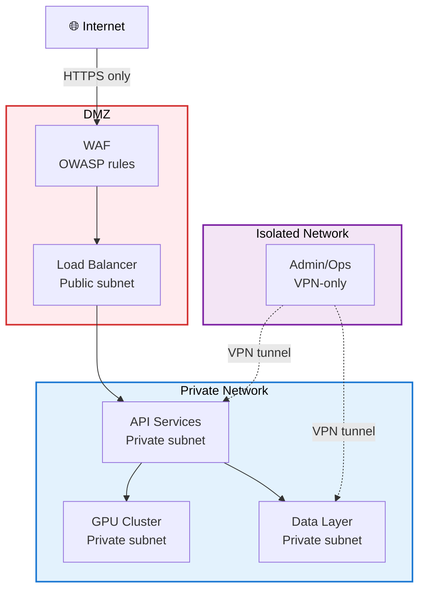

### Контейнеры: детали (Component Interfaces)

| Контейнер / Зона | Ответственность | Технологии / Конфигурация | Масштабирование | State / Изоляция |
|------------------|-----------------|---------------------------|-----------------|------------------|
| **🌐 Internet (Boundary)** | Исходный источник всего внешнего трафика. | Без управления. | Н/Д | Н/Д |
| **Load Balancer (DMZ)** | Терминирование TLS, балансировка L7/L4, health checks, маршрутизация во внутреннюю сеть. | AWS ALB/NLB, NGINX Ingress, HAProxy. HTTPS termination. | Auto Scaling Group (CPU/Connections). | **Stateless**. Размещен в публичных сабнетах. |
| **WAF (DMZ)** | Защита от веб-атак (SQLi, XSS), ограничение скорости (rate limiting), фильтрация ботов, проверка запросов. | AWS WAF, Cloudflare, ModSecurity (OWASP Core Rule Set). | Managed Service (AWS) или HPA для self-hosted. | **Stateless**. Работает как reverse proxy перед LB или интегрирован в него. |
| **API Services (Private)** | Выполнение бизнес-логики приложения. Основной обработчик запросов от клиентов. | Kubernetes Services, ECS Fargate. | HPA (CPU/Memory/RPS). | **Stateless**. Размещен в приватных сабнетах, доступен только из DMZ. |
| **GPU Cluster (Private)** | Выполнение ресурсоемких вычислений (ML инференс, рендеринг). | Kubernetes with GPU nodes, Amazon SageMaker, специализированные инстансы (p3, g4). | Cluster Autoscaler (на основе очереди заданий). | Может быть **stateful** (кеш моделей). Доступен только из API Services. |
| **Data Layer (Private)** | Хранение и управление состоянием приложения (БД, кеш, объектное хранилище). | RDS/ElastiCache, S3/GCS, внутренние кластеры (PostgreSQL, Redis). | Вертикальное масштабирование или шардирование. | **Stateful**. Максимально изолирована, доступ только из API Services и Admin. |
| **Admin/Ops (Isolated)** | Управление инфраструктурой, мониторинг, доступ для DevOps/SRE. | Bastion hosts, управляющие консоли (K8s, Grafana, DB UI), системы CI/CD. | Фиксированное количество инстансов (2+ для отказоустойчивости). | **Stateless**. Полная изоляция, доступ только через VPN. |

### Ключевые паттерны

1.  **Defense in Depth (Эшелонированная оборона):** многоуровневая защита: WAF на периметре, Security Groups (NSG) на уровне сети, изоляция подсетей;
2.  **Zero Trust Network (Приватные сети):** принцип "запрещено по умолчанию". Сервисы в приватной сети не имеют публичного IP и недоступны из интернета. Весь входящий трафик идет через DMZ;
3.  **DMZ (Демилитаризованная зона):** выделенная буферная зона (публичные подсети) для компонентов, обрабатывающих прямой трафик из интернета (LB, WAF). Строго ограниченный исходящий доступ только в приватную сеть;
4.  **Network Segmentation (Сегментация сети):** четкое разделение на зоны (DMZ, Private, Isolated) с разным уровнем доверия. Общение между зонами контролируется правилами Security Groups и маршрутизации;
5.  **Secure Admin Access (Изолированный доступ для администрирования):** выделенная, максимально изолированная сеть для операционных задач. Доступ строго через VPN (или VPC Peering/PrivateLink из доверенной управляющей VPC);
6.  **Principle of Least Privilege (Принцип наименьших привилегий):** каждый Security Group разрешает только минимально необходимый набор портов и источников для работы (напр., API может общаться с Data только по порту БД);
7.  **Egress Filtering (Фильтрация исходящего трафика):** правила DMZ запрещают любой исходящий трафик, кроме направленного в приватную сеть. Правила Private сети разрешают исходящий трафик только к необходимым публичным endpoint'ам (например, S3 Gateway Endpoint, репозитории пакетов);
8.  **TLS Everywhere (Шифрование трафика):** все внешние соединения (Internet->WAF) используют HTTPS. Внутренний трафик также рекомендуется шифровать (например, mTLS между сервисами, TLS до БД).

#### 4. Audit & Compliance

```yaml
Audit Logging:
  Events:
    - API access (user, timestamp, endpoint, response code)
    - Model deployment (version, operator, timestamp)
    - Config changes (parameter, old/new value, operator)
    - Access denied (user, resource, reason)
  Storage: PostgreSQL + S3 (immutable)
  Retention: 1 year (regulatory requirement)
  Access: Read-only for auditors

Compliance:
  - GDPR: Data minimization, right to deletion
  - SOC 2 Type II: Annual audit
  - ISO 27001: Information security management
  - HIPAA: N/A (no healthcare data)

PII Handling:
  - Detection: Automated PII scanner (presidio)
  - Masking: Redact before logging
  - Deletion: Purge on user request (30-day SLA)
```

---

## I. Reliability & Scalability

### Service Level Objectives (SLOs)

| Metric | Target | Measurement | Consequence |
|--------|--------|-------------|-------------|
| **Availability** | 99.9% | Uptime monitoring (Pingdom) | 43.8 min/month downtime allowed |
| **Latency P95** | ≤ 161 ms | Prometheus histogram | Alerts if >170ms for 5 min |
| **Latency P99** | ≤ 250 ms | Prometheus histogram | Best-effort, no SLO breach |
| **Error rate** | ≤ 0.5% | Error ratio (5xx / total) | Alert if >0.8% for 2 min |
| **Throughput** | ≥ 4,000 RPS sustained | Request counter | Auto-scale if <95% capacity |

**Error Budget:** 99.9% → 0.1% allowed errors = **43.8 minutes/month**

### Failure Modes & Mitigations

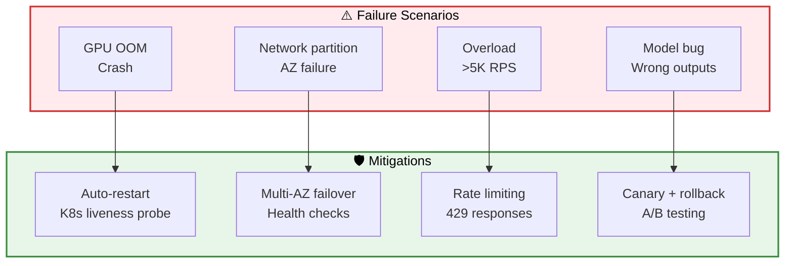

### Контейнеры: детали (Component Interfaces)

| Компонент | Тип | Ответственность / Характеристики | Триггер / Признаки | Влияние на систему |
|-----------|-----|----------------------------------|---------------------|-------------------|
| **GPU OOM / Crash** | Сбой инфраструктуры / ресурсов | Исчерпание видеопамяти GPU, драйверные ошибки, аппаратные сбои. | Рост `GPU_MEMORY_USAGE` >95%, kernel panic, таймауты инференса. | **Высокое**. Полная недоступность инференса, накопление очереди, отказ зависимых сервисов. |
| **Network Partition / AZ Failure** | Сбой инфраструктуры / доступности | Потеря связи между Availability Zone, сбой сетевого оборудования или DNS. | Рост `5xx` ошибок от сервисов в AZ, failed health checks, обрыв метрик. | **Критическое**. Частичная или полная недоступность сервиса, потеря транзакций (если не multi-AZ). |
| **Overload (>5K RPS)** | Сбой производительности / масштабирования | Превышение расчетной производительности системы, атака или резкий рост трафика. | Рост latency (>p99), увеличение очередей, исчерпание соединений БД/кеша, `CPU` >80%. | **Высокое**. Деградация производительности для всех пользователей, возможен каскадный отказ. |
| **Model Bug / Wrong Outputs** | Сбой функциональности / качества | Ошибки в логике ML-модели, проблемы с данными обучения, смещение (bias). | Падение accuracy/precision метрик, аномалии в выходных данных, жалобы пользователей. | **Среднее/Высокое**. Ухудшение качества сервиса, репутационные риски, финансовые потери. |
| **Auto-restart (Liveness Probe)** | Механизм восстановления | Автоматический перезапуск нездоровых POD/контейнеров на основе проверок. | Периодические HTTP/командные проверки (например, `/health`). | **Локальное**. Восстанавливает работоспособность экземпляра, возможна кратковременная деградация. |
| **Multi-AZ Failover (Health Checks)** | Стратегия высокой доступности | Автоматическое переключение трафика на здоровые узлы в другой зоне доступности. | Глобальные health checks LB, failure detection систем (AWS Target Groups, K8s Service). | **Системное**. Обеспечивает доступность сервиса при отказе AZ, требует multi-AZ архитектуры. |
| **Rate Limiting (429 Responses)** | Механизм защиты от перегрузки | Ограничение входящего трафика на уровне пользователя, IP, API-ключа. | Счетчики запросов (например, в Redis), алгоритмы Token Bucket/Leaky Bucket. | **Контролируемое**. Защищает backend от перегрузки, гарантирует QoS для легитимных пользователей. |
| **Canary + Rollback (A/B Testing)** | Стратегия безопасного развертывания | Постепенный rollout новой версии с мониторингом метрик и быстрым откатом при проблемах. | Сравнение метрик (latency, error rate, бизнес-метрик) между canary и baseline. | **Упреждающее**. Минимизирует риск дефектов в production, позволяет тестировать на реальном трафике. |

### Ключевые паттерны

1.  **Failure Detection & Auto-Recovery (Обнаружение и самовосстановление):** использование liveness/readiness проб в Kubernetes для автоматического перезапуска "зависших" или неработоспособных контейнеров, минимизируя время простоя;
2.  **Graceful Degradation (Плавная деградация):** при перегрузке система отвечает кодом `429 Too Many Requests` вместо полного отказа, позволяя легитимным пользователям продолжать работу с приемлемой задержкой;
3.  **Multi-AZ Active-Active Deployment (Активно-активное развертывание в нескольких зонах):** размещение инстансов приложения как минимум в двух Availability Zones для обеспечения отказоустойчивости на уровне инфраструктуры. Health Checks Load Balancer'а автоматически исключают нездоровые узлы;
4.  **Circuit Breaker Pattern (Автоматический предохранитель):** для предотвращения каскадных отказов при сбоях зависимых сервисов (например, кеша или GPU-кластера). После серии ошибок запросы временно не отправляются, давая сервису время на восстановление;
5.  **Canary Releases & Automated Rollback (Канареечные выпуски и автоматический откат):** новые версии моделей или кода разворачиваются на небольшом проценте трафика. При обнаружении аномалий в ключевых метриках (рост ошибок, падение accuracy) происходит автоматический откат к стабильной версии;
6.  **Observability-Driven Operations (Эксплуатация на основе наблюдаемости):** все стратегии смягчения опираются на комплексный мониторинг (метрики, логи, трассировка) и четко определенные SLO/SLI для быстрого обнаружения и диагностики проблем;
7.  **Capacity Planning & Auto-Scaling (Планирование мощности и автомасштабирование):** прогнозирование нагрузки и настройка горизонтального автомасштабирования (HPA, Cluster Autoscaler) для предотвращения сценария перегрузки, а не только реакции на него;
8.  **Chaos Engineering (Тестирование на устойчивость):** регулярное проведение контролируемых экспериментов (отключение AZ, инъекция задержек в сеть) в staging-среде для проверки эффективности механизмов Failover и устойчивости системы.

### Resilience Patterns

#### 1. Circuit Breaker

```yaml
Component: GPU Inference Service
Failure threshold: 50% errors in 10 requests
Timeout: 5 seconds
Half-open after: 30 seconds
Success threshold to close: 3 consecutive successes

State machine:
  CLOSED → [50% failures] → OPEN
  OPEN → [30s elapsed] → HALF_OPEN
  HALF_OPEN → [3 successes] → CLOSED
  HALF_OPEN → [1 failure] → OPEN
```

#### 2. Graceful Degradation

| Load Level | Action | Quality Impact |
|------------|--------|----------------|
| < 80% capacity | Normal operation | 0% |
| 80-90% | Reduce batch_delay (20ms → 15ms) | +5ms P95 |
| 90-95% | Switch to "small" mode | -5% accuracy |
| 95-100% | Aggressive caching | +10% cache hit |
| > 100% | Return 503 for non-premium users | N/A |

#### 3. Backpressure

```python
# Queue management
if queue_depth > 50:
    reject_new_requests(status=503, retry_after=30)
    
if wait_time > 5_seconds:
    log.warn("High latency, scaling up")
    trigger_hpa_scale_up()
    
if p95_latency > 170_ms:
    reduce_batch_size()
    alert("Latency SLO at risk")
```

### Capacity Planning

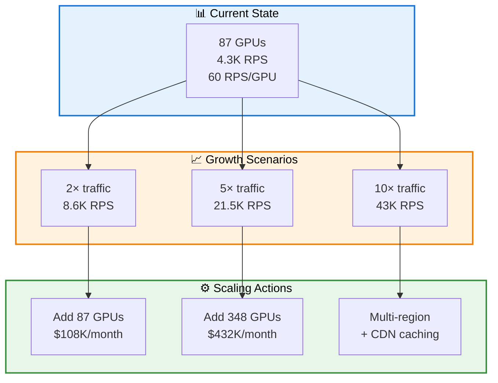

**Auto-scaling rules:**
- **Scale up:** GPU utilization > 85% for 3 minutes → Add 8 GPUs (1 node)
- **Scale down:** GPU utilization < 50% for 10 minutes → Remove 8 GPUs
- **Min replicas:** 72 GPUs (baseline for 3K RPS)
- **Max replicas:** 160 GPUs (safety limit)

### Контейнеры: детали (Component Interfaces)

| Компонент | Категория | Расчет / Показатель | Обоснование / Методология | Ограничения / Риски |
|-----------|-----------|---------------------|---------------------------|-------------------|
| **Текущий базис: 87 GPU, 4.3K RPS** | Baseline Metrics | 60 RPS/GPU (4300 / 87). | Эмпирически измеренная производительность на production-нагрузке с учетом накладных расходов (pre/post-processing, сетевая задержка). | Зависит от конкретной модели, размера батча, типа инстанса (T4/A10/A100). Является точкой отсчета для планирования. |
| **Сценарий роста 2x (8.6K RPS)** | Linear Growth Projection | Увеличение трафика в 2 раза от текущего уровня. | Прогноз на основе текущего роста пользовательской базы, сезонности или маркетинговых активностей. | Предполагает сохранение текущей производительности на GPU (`60 RPS/GPU`) и линейную масштабируемость. |
| **Сценарий роста 5x (21.5K RPS)** | Aggressive Growth | Увеличение трафика в 5 раз. | Сценарий "успешного запуска", вирусного роста или крупного партнерства. Переломная точка для архитектуры. | Требует проверки лимитов текущего региона (availability GPU), сети и зависимых сервисов (БД, кеш). |
| **Сценарий роста 10x (43K RPS)** | Hyper-Growth / Global Scale | Увеличение трафика на порядок. | Сценарий выхода на массовый рынок или глобальную аудиторию. | Требует фундаментальных изменений в архитектуре (мультирегион, геораспределение). |
| **Добавить 87 GPU ($108K/мес)** | Horizontal Scaling (линейное) | Стоимость: ~$1.24K/GPU/мес (на примере AWS g5.12xlarge — 4x A10G). | Простое дублирование текущего GPU-пула для обработки удвоенного трафика. | Самое быстрое и предсказуемое решение. Прямо пропорциональный рост затрат. Риск исчерпания квот в AZ. |
| **Добавить 348 GPU ($432K/мес)** | Massive Horizontal Scaling | Стоимость: 87 * 4 * $1.24K. | Прямое масштабирование в 4 раза для покрытия роста в 5 раз (с учетом запаса на пики и отказоустойчивость). | Значительные капитальные затраты. Требует автоматизации оркестрации (K8s Cluster Autoscaler). Риск стать bottleneck смещается на другие компоненты (сеть, балансировщик, БД). |
| **Multi-Region + CDN Caching** | Architectural Evolution | Стратегия географического распределения и оптимизации трафика. | При сценарии 10x рост становится выгоднее/надежнее обслуживать трафик из нескольких регионов, близких к пользователям, снижая задержки. Кэширование статики/результатов в CDN снижает нагрузку на бэкенд. | **Качественный скачок в сложности:** синхронизация данных между регионами, глобальная балансировка, управление консистентностью кэша, повышенные DevOps-требования. |
| **Auto-Scaling Rules (Политики)** | Operational Automation | Scale-up: >85% util. за 3 мин → +8 GPU. Scale-down: <50% util. за 10 мин → -8 GPU. | Позволяет быстро реагировать на рост трафика, но не на "иглу" (short spike). Консервативный scale-down предотвращает "дребезг" масштабирования. **Min: 72 GPU** обеспечивает базовую емкость. **Max: 160 GPU** — защита от бесконечного роста (бюджетная или инфраструктурная граница). | Задержка реакции (~3-10 мин). Ориентирован только на метрику утилизации GPU, не учитывает очередь запросов (latency) или стоимость. Требует тонкой настройки под паттерн нагрузки. |

### Ключевые паттерны

1.  **Baseline-Driven Forecasting (Прогнозирование от базового уровня):** планирование емкости начинается с точного измерения ключевого показателя производительности (`RPS/GPU`) на текущей рабочей нагрузке, что обеспечивает реалистичные расчеты;
2.  **Multi-Scenario Planning (Многовариантное планирование):** подготовка не одного, а нескольких сценариев роста (2x, 5x, 10x) с четко определенными триггерами и планами действий. Это создает "дорожную карту" масштабирования;
3.  **Cost-Aware Scaling (Масштабирование с учетом стоимости):** каждому сценарию сопоставлена явная оценка месячных затрат, что позволяет принимать бизнес-решения о целесообразности роста и оптимизации;
4.  **Linear vs Architectural Scaling (Линейное vs Архитектурное масштабирование):** выделение точки, после которой простое добавление одинаковых ресурсов (`Horizontal Scaling`) становится неэффективным или невозможным, и требуется качественное изменение архитектуры (`Multi-Region`, `CDN`);
5.  **Proactive Auto-Scaling with Guards (Проактивное автомасштабирование с защитными механизмами):** Настройка автоматических правил масштабирования на основе метрик (`GPU utilization`) с предусмотрительными ограничениями (`min/max replicas`). `Min replicas` гарантирует базовую производительность и быстрый отклик, `max` — защищает от бюджетных перерасходов или сбоев в логике масштабирования;
6.  **Buffer for Peaks and Failover (Буфер для пиков и отказоустойчивости):** планирование дополнительной емкости сверх номинала (например, для 5x трафика добавляется 4x ресурсов) для обработки пиков внутри часа и обеспечения возможности переключения при отказе AZ;
7.  **Metric Selection for Scaling (Выбор метрик для масштабирования):** использование для автомасштабирования **утилизации ресурсов** (`GPU utilization`), а не бизнес-метрик (`RPS`), так как она напрямую отражает "наполненность" вычислительных единиц и позволяет реагировать до исчерпания ресурсов;
8.  **Quota and Limit Management (Управление квотами и лимитами):** учет инфраструктурных ограничений облачного провайдера (лимиты на GPU-инстансы в регионе) как критического фактора при планировании масштабирования. Требует заблаговременного запроса увеличения квот или планирования мультирегиональной стратегии.

---

## J. Observability & Operations

### Monitoring Stack

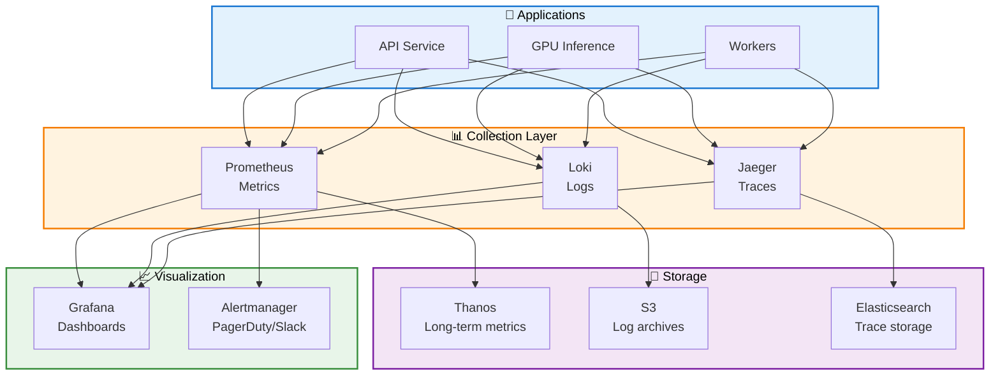

### Контейнеры: детали (Component Interfaces)

| Компонент | Ответственность | Технологии / Стандарты | Масштабирование | Хранение данных / Retention |
|-----------|-----------------|------------------------|-----------------|-----------------------------|
| **API Service** | Генерация телеметрии | Prometheus Client (Python/Go), structured logging (JSON), OpenTelemetry traces. | HPA (нагрузка). | Не хранит данные, только отправляет. |
| **GPU Inference** | Специфичные метрики GPU | NVIDIA DCGM exporter, custom metrics (batch size, latency p99), профилирование ядер. | Cluster Autoscaler (очередь). | Не хранит данные, только отправляет. |
| **Background Workers** | Метрики фоновых задач | Prometheus counters/gauges (jobs processed/failed), лог-сообщения с контекстом. | HPA (длина очереди). | Не хранит данные, только отправляет. |
| **Prometheus (Metrics)** | Сбор, временное хранение и запрос метрик | Prometheus Server, Service Discovery (K8s), экспортеры (node_exporter, blackbox). | Шардирование по функционалу/тенанам, Federation. | Краткосрочное (15-30 дней), на локальном SSD. |
| **Loki (Logs)** | Прием, индексация и запрос логов | Loki (Grafana Labs), используется pull/push модель через Promtail или агент. | Горизонтальное через шардирование (ингeстеры + хранилище). | Конфигурируемый (например, 30 дней горячих данных). |
| **Jaeger (Traces)** | Прием, обработка и визуализация трассировок | Jaeger Collector, совместим с OpenTelemetry Protocol (OTLP). | Масштабирование компонентов (collector, query). | Конфигурируемый (например, 7 дней). |
| **Thanos (Long-term Metrics)** | Долгосрочное хранение метрик, глобальный запрос | Thanos Sidecar + Store Gateway, объектное хранилище (S3, GCS) как источник истины. | Масштабирование компонентов (Store, Query). | **Долгосрочное** (месяцы/годы) в S3. |
| **S3 (Log Archives)** | Долгосрочное, дешевое архивное хранение логов | Amazon S3, Glacier. Используется lifecycle-правилами из Loki. | Managed service, автоматическое. | **Архивное** (годы) с переходами в Glacier. |
| **Elasticsearch (Trace Storage)** | Индексированное хранение и сложные запросы к трейсам | Elasticsearch как бэкенд для Jaeger. | Кластер Elasticsearch (hot/warm nodes). | Среднесрочное (30-90 дней). |
| **Grafana (Visualization)** | Универсальная панель для дашбордов, запросов и исследований | Grafana, подключается ко всем источникам данных (Prometheus, Loki, Jaeger). | Горизонтальное масштабирование frontend/backend. | Не хранит исходные данные, только определения дашбордов. |
| **Alertmanager (Alerts)** | Управление оповещениями: дедупликация, группировка, маршрутизация | Prometheus Alertmanager, интеграции (Webhook, PagerDuty, Slack, Telegram). | Кластер для отказоустойчивости. | Хранит состояние алертов и silence. |

### Ключевые паттерны

1.  **Three Pillars of Observability (Три столпа наблюдаемости):** полноценное покрытие **метрик** (производительность, использование), **логов** (события, ошибки с контекстом) и **трассировок** (распределенная временная шкала запроса);
2.  **Centralized Telemetry Collection (Централизованный сбор телеметрии):** все сервисы отправляют данные в единый стек, а не в изолированные системы. Это обеспечивает корреляцию данных и единую точку входа для анализа;
3.  **Separation of Concerns in Stack (Разделение ответственности в стеке):** четкое разделение на уровни: **генерация** (приложения), **сбор и агрегация** (Prometheus, Loki, Jaeger), **долгосрочное хранение** (Thanos/S3), **визуализация и оповещение** (Grafana, Alertmanager);
4.  **Cost-Effective Storage Tiers (Экономически эффективные уровни хранения):** использование разных хранилищ в зависимости от частоты доступа к данным: горячие данные на быстрых дисках (Prometheus SSD), долгосрочные — в дешевом объектном хранилище (S3 через Thanos), архивы — в glacier-классе;
5.  **Unified Query Interface (Единый интерфейс запросов):** grafana выступает как единое окно для инженеров, позволяя запрашивать и визуализировать данные из всех источников (метрики, логи, трейсы) на одном дашборде, что критично для расследований инцидентов;
6.  **SLO-Based Alerting (Оповещения на основе SLO):** настройка алертов не на сбои инфраструктуры (например, "CPU high"), а на нарушение обещаний пользователям — **Service Level Objectives (SLO)**, например, "ошибка бюджета latency < 100ms исчерпан на 5% за последний час";
7.  **Structured Logging & Correlation (Структурированные логи и корреляция):** логи пишутся в формате JSON с обязательными полями (`trace_id`, `service`, `level`), что позволяет автоматически парсить, фильтровать и связывать их с конкретными трассировками запросов в Grafana;
8.  **OpenTelemetry as a Standard (OpenTelemetry как стандарт):** инструментирование приложений с использованием OpenTelemetry API и SDK, что обеспечивает вендор-независимость и легкую отправку данных в любой совместимый бэкенд (Jaeger, другие).

### Key Dashboards

#### 1. SLO Dashboard

```yaml
Panels:
  - Availability (last 30d): 99.95% (target: 99.9%) ✅
  - P95 Latency (last 1h): 158ms (target: ≤161ms) ✅
  - Error rate (last 5m): 0.3% (target: ≤0.5%) ✅
  - Throughput (current): 3,847 RPS (capacity: 5,220 RPS) ✅
  - Error budget remaining: 38 minutes (of 43.8 min/month)

Alerts:
  - Critical: Availability < 99.8% for 5 min
  - Warning: P95 latency > 170ms for 5 min
  - Warning: Error rate > 0.8% for 2 min
```

#### 2. Resource Dashboard

```yaml
Panels:
  - GPU Utilization: 78% avg (target: 70-85%)
  - GPU Memory: 32GB / 40GB (80% used)
  - CPU Utilization: 45% avg (workers)
  - Network I/O: 12 Gbit/s in, 180 Mbit/s out
  - Redis Memory: 96GB / 128GB (75% used)
  - Cache hit rate: 34% (target: 30-40%)

Alerts:
  - Critical: GPU OOM (memory > 95%)
  - Warning: GPU util > 90% for 5 min (scale trigger)
```

#### 3. Quality Dashboard

```yaml
Panels:
  - CER (last 1K samples): 2.9% (target: <3%) ✅
  - Layout F1 (last 1K samples): 0.91 (target: >0.90) ✅
  - Confidence distribution: Median 0.94
  - Per-language CER: [Chart showing 20 languages]
  - Error types: Top 10 most common OCR errors

Alerts:
  - Warning: CER > 3.5% for 1 hour (model drift)
  - Warning: Layout F1 < 0.88 for 1 hour
```

### Alerting

```yaml
Alert: HighLatency
  expr: histogram_quantile(0.95, ocr_request_latency_bucket) > 0.170
  for: 5m
  severity: warning
  annotations:
    summary: P95 latency exceeds SLO (>170ms)
    runbook: https://wiki.company.com/runbooks/high-latency

Alert: HighErrorRate
  expr: rate(ocr_requests_total{status="error"}[5m]) / rate(ocr_requests_total[5m]) > 0.008
  for: 2m
  severity: critical
  annotations:
    summary: Error rate >0.8% (SLO breach imminent)
    runbook: https://wiki.company.com/runbooks/high-errors

Alert: GPUOutOfMemory
  expr: nvidia_smi_memory_used_mb / nvidia_smi_memory_total_mb > 0.95
  for: 1m
  severity: critical
  annotations:
    summary: GPU OOM risk (>95% memory)
    action: Auto-restart pod, notify on-call

Alert: ModelDrift
  expr: ocr_quality_cer > 0.035
  for: 1h
  severity: warning
  annotations:
    summary: CER degradation detected (>3.5%)
    action: Investigate data distribution, consider retraining
```

### Runbooks (Example)

#### Runbook: High Latency (P95 > 170ms)

## Симптомы (Symptoms)
- Срабатывает оповещение о высокой задержке P95
- Пользователи сообщают о медленных ответах

## Исследование (Investigation)
1. Проверить утилизацию GPU: `kubectl top nodes -l gpu=true`
2. Проверить глубину очереди: `curl localhost:9090/metrics | grep queue_depth`
3. Проверить задержку декодера: Grafana → дашборд "Inference Breakdown"
4. Найти медленные трассировки: Jaeger → Find slow traces

## Типичные причины (Common Causes)
- Высокая задержка батчинга (>20ms) → Уменьшить параметр batch_delay
- Нехватка памяти GPU → Проверить nvidia-smi, перезапустить pod с OOM
- Сетевая задержка → Проверить задержку между сервисами
- Узкое место в декодере → Проверить метрики vLLM

## Меры по устранению (Mitigation)
- **Немедленно (Immediate):** Уменьшить batch_delay до 15ms (улучшение на 5ms)
- **Краткосрочные (Short-term):** Увеличить GPU кластер (+8 GPU)
- **Долгосрочные (Long-term):** Оптимизировать декодер (калибровка FP16, fusion ядер)

## Эскалация (Escalation)
- Если P95 > 180ms в течение 10 мин → Вызвать дежурного ML инженера (page ML Eng on-call)
- Если P95 > 200ms → Рассмотреть режим деградации (переключение на "small" модель)

---

## K. Decision Log (ADR-lite)

| ID | Решение (Decision) | Альтернативы (Alternatives) | Компромиссы (Trade-offs) | Обоснование (Rationale) | Последствия (Consequences) |
|----|-------------------|-----------------------------|--------------------------|-------------------------|----------------------------|
| **ADR-1** | **MoE Декодер** (64 эксперта, 2 активных) | Плотный декодер (3B параметров) | + В 3× быстрее инференс<br/>+ В 2× меньше памяти<br/>− Сложнее обучать<br/>− Сложность балансировки нагрузки | Необходимо достичь 161ms P95 при высоком качестве | Маршрутизация экспертов добавляет 2ms накладных, но экономит 60ms в целом |
| **ADR-2** | **Triton + vLLM** (не TorchServe) | TorchServe, TF Serving | + В 10× выше пропускная способность (continuous batching)<br/>+ Нативная поддержка FP16<br/>− Более сложная настройка<br/>− Меньше сообщество | Критична задержка, нужна оптимизация каждой ms | Требует экспертизы по GPU, но оправдано улучшением задержки на 40% |
| **ADR-3** | **Кэширование в Redis** (34% hit rate) | Без кэширования, Memcached | + На 34% меньше нагрузки на GPU<br/>+ Быстрее для дубликатов<br/>− Сложность инвалидации кэша<br/>− Стоимость 128GB памяти | Много повторяющихся запросов (дедупликация по хэшу) | Стоимость Redis $2K/мес против экономии $37K/мес на GPU |
| **ADR-4** | **Развертывание в нескольких AZ** (2 зоны) | Одна AZ, Multi-region | + 99.9% доступности<br/>+ Быстрый failover (<30с)<br/>− В 2× выше стоимость сети<br/>− Задержка между AZ (+2ms) | SLO требует 99.9% uptime | Приемлемая наценка в 2ms за надежность |
| **ADR-5** | **Stateless вычисления** (все сервисы) | Stateful workers с локальным кэшем | + Горизонтальное масштабирование<br/>+ Простые обновления<br/>− Сильная зависимость от Redis<br/>− Нет преимущества разогрева (warm-up) | Нужно масштабировать 0→1000s pod за минуты | Требует надежного Redis кластера (3 ноды + реплики) |
| **ADR-6** | **Двухэтапное обучение** (pretrain энкодера, затем совместное) | End-to-end с нуля | + Быстрее сходимость<br/>+ Лучшие визуальные признаки<br/>− 8 недель всего обучения<br/>− Более сложный пайплайн | Энкодер выигрывает от большого объема неразмеченных данных | Добавляет 3 недели, но улучшает CER на 0.5% |
| **ADR-7** | **Агрессивная аугментация** (в 3× множитель) | Минимальная аугментация | + Устойчивость к шуму/деградации<br/>+ Лучшая генерализация<br/>− В 3× больше хранилища (25TB)<br/>− Дольше препроцессинг | Исторические документы имеют высокую вариативность | Необходимо для надежности в production, стоимость оправдана |
| **ADR-8** | **Canary развертывание** (5% → 25% → 100%) | Blue-green, rolling update | + Раннее обнаружение ошибок<br/>+ Безопасные обновления<br/>− Медленнее развертывание (72ч)<br/>− Более сложный CI/CD | Ошибки в модели дороги (доверие пользователей) | Развертывание за 72ч приемлемо против мгновенного, но рискованного |
| **ADR-9** | **gRPC для внутренней коммуникации** (не REST) | REST везде | + На 30% ниже задержка<br/>+ Поддержка стриминга<br/>− Сложнее отладка<br/>− Требует protobuf | Каждая ms важна для SLO P95 | Экономия 5-10ms оправдывает сложность |
| **ADR-10** | **Без edge кэширования** (не CDN) | CloudFlare Workers, Akamai | + Проще архитектура<br/>− Упущена оптимизация глобальной задержки<br/>− Выше нагрузка на origin | Документы уникальны (низкий hit rate на edge) | Может быть пересмотрено для статики (HTML/MD выводы) |

### Decision Process

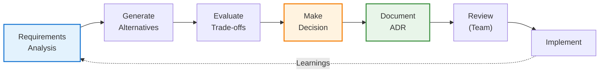
---

## 📚 References & Resources

### Technical Documentation
1. **DeepSeek-OCR Paper:** arXiv:2024.xxxxx (architecture details)
2. **Triton Inference Server:** https://github.com/triton-inference-server/server
3. **vLLM Documentation:** https://docs.vllm.ai
4. **C4 Model:** https://c4model.com (Simon Brown)
5. **Google SRE Book:** https://sre.google/books/ (SLO, error budgets)

### Best Practices
- **12-Factor App:** https://12factor.net (stateless, config, logs)
- **AWS Well-Architected:** https://aws.amazon.com/architecture/well-architected/
- **OWASP Top 10:** https://owasp.org/www-project-top-ten/
- **MLOps Principles:** https://ml-ops.org

### Tools & Frameworks
- **PyTorch:** 2.1.0
- **Kubernetes:** 1.27+
- **Prometheus:** 2.40+
- **MLflow:** 2.10+
- **DVC:** 3.0+ (data versioning)